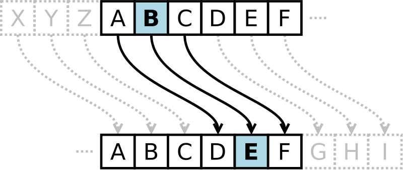

# Día 13: El Cifrado César

Esta es una de las técnicas más simples y más usadas. Es un tipo de cifrado por sustitución en el que una letra en el texto original es reemplazada por otra letra que se encuentra un número fijo de posiciones más adelante en el alfabeto.



Para el caso de la Imagen, la letra A se reemplaza por la letra D, la B por la E y la C por la F. Aquí se desplaza un n=3 posiciones de la letra original.

¿Qué deberías presentar?

- Programa un bloque o función que reciba como parámetro una cadena de texto y un número que indique cuántas posiciones se tiene que desplazar desde la posición original.
- Programa un bloque o función que reciba como parámetro una cadena cifrada y un número n, con la finalidad de que se puede la cadena Original
- En este caso el cifrado para los anteriores problemas es únicamente para el alfabeto, que pasa si un usuario quiere añadir números y caracteres especiales en un orden dado, ¿Cómo solucionarías el problema?, Pon un ejemplo haga uso de números y caracteres especiales.

## Solución

La solución es tan simple como sumar la llave al valor decimal de cada caracter de la cadena de texto. En caso de descifrar hay que restar la llave. Esto resulta en la siguiente función:

```python
def cesar(text: str, key: int, decrypt=False) -> str:
    factor = -1 if decrypt else 1
    cipher = map(lambda x: chr(ord(x) + factor * key), text)
    return "".join(cipher)
```
