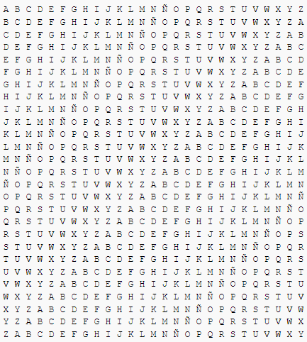

# Día 14: Vigenère

El día de hoy vamos a implementar el cifrado El cifrado de Vigenère, es un cifrado por sustitución simple polialfabético. Este cifrado es conocido porque es fácil de entender e implementar, además parece irresoluble; esto le hizo valedor del apodo el código indescifrable.

Para esto se construye la siguiente tabla:



Con esta tabla construida, vamos a encriptar el siguiente mensaje

```bash
Mensaje: AEIS GOD
Clave: GVFH YGI
Criptograma: GZNZ MDL
```

¿Qué deberías presentar?

- Programa un bloque o función que reciba como parámetro una cadena de texto y genere un criptograma de forma aleatoria.
- Programa un bloque o función que reciba como parámetro una cadena cifrada y una clave de 27 letras que represente la clave y muestre como salida el mensaje original
- **OPCIONAL** Supongamos que entregamos un criptograma a Bob, que podríamos producir para que Bob logre tener el mensaje original, sin la necesidad de pasarle el listado de las 27 letras de la clave.

## Otras soluciones

- [@el_de_men_cial](https://www.instagram.com/p/CjuYlZ-O2pM/)
- [@jamenajamena173](https://www.instagram.com/p/CjtyGTXNeX9/)
