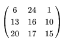
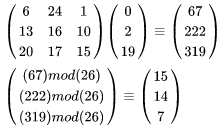

# Día 15: Hill

Siguiendo con nuestros retos de criptografía, emplearemos el día de hoy una técnica de cifrado denominada Cifrado de Hill.

Es un cifrado de sustitución poligráfica basado en el álgebra lineal. Para emplear este método de cifrado es necesario conocer un poco de matrices, pero supongo eso no es reto ¿verdad? 🤔.

El cifrado de Hill inicia definiendo nuestro alfabeto, `A=0`, `B=1`, `C=2`..., así con la cantidad de caracteres que deseemos (n).

Para encriptar un mensaje, cada bloque de n letras está multiplicado por una matriz invertible n×n. Para desencriptar el mensaje, cada bloque es multiplicado por el inverso de la matriz usada para la encriptación.

Para el ejemplo, nuestra matriz de encripción es: `GYBNQKURP` que es su forma matricial es:



Si el mensaje que seamos cifrar es: `ACT`, podemos realizar la operación de multiplicación de matrices para obtener la siguiente operación



Donde la operación `mod(26)`, la cantidad viene del tamaño del vector conocido como diccionario y definido al inicio del problema.

## Solución

La solución es relativamente sencilla si seguimos los pasos tal y como se explica en el enunciado. Usamos numpy para realizar las operaciones de multiplicación de matrices y el módulo de 26 para obtener el resultado.

```python
def hill(text, key, symb):
    n = int(np.sqrt(len(key)))

    T = map(lambda c: symb.index(c), text)
    T = np.array(list(T))
    T = T.reshape(n, int(len(text) / n))

    K = map(lambda c: symb.index(c), key)
    K = np.array(list(K)).reshape(n, n)

    C = np.dot(K, T)
    C = np.mod(C, len(symb)).flatten()
    return np.dot(K, T)
```
