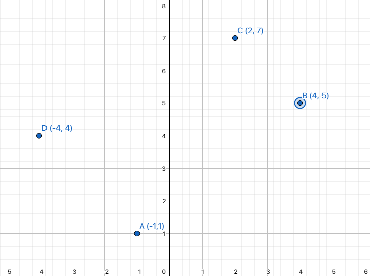
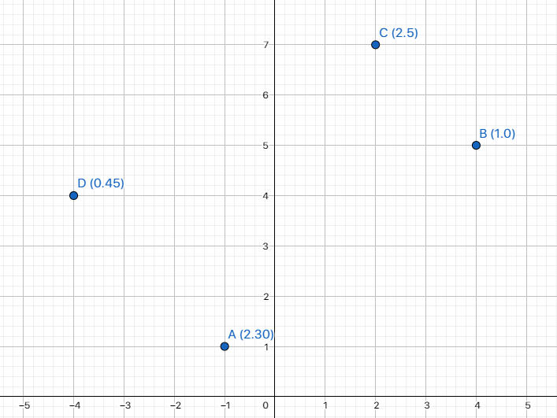

# Día 3: Geometría

Un usuario que se decica a realizar trabajos lo contrata a usted y le dice que quiere que usted le ayude a crear un programa que le muestre el orden en que tiene que ir a los diferentes sistios a cumplir con sus tareas ya sea por distancia o por hora.

En el caso de la distancia, el trabajador toma cualquier punto como inicio, es decir el punto es tomado aleatoriamente. Digamos que inicia en el punto D de la siguiente imagen:



El usuario va realizando los trabajos que le resultan más cercanos, es decir para la imagen el orden en el que realizaría los trabajos como inicio el punto D es:

1. D
2. A
3. B
4. C

Este orden lo obtuvimos al aplicar la ecuación de la distancia entre dos puntos. Podemos ver que no se vuelve a considerar los puntos en los que ya trabajó el usuario.

En el caso de las horas el usuario siempre inicia por el trabajo que mayor cantidad de horas le lleva, veamos la aisgnación de horas en cada punto en la siguiente imagen:



En este caso, el orden de trabajos según las horas que le toma sería:

1. C (Dos horas con cincuenta minutos)
2. A (Dos horas con treinta minutos)
3. B (Una hora)
4. D (Cuarenta y cinco minutos)

¿Qué deberías presentar?

1. Programa un bloque o función que tome como entrada los puntos de coordenadas y las horas (si es necesario) que se demora en cada trabajo (cada punto) y retorne el orden que el usuario tiene que seguir si decide trabajar por distancias (Mira la primera lista).
2. Programa un bloque o función que tome como entrada los puntos de coordenadas y las horas (si es necesario) que se demora en cada trabajo (cada punto) y retorne el orden que el usuario tiene que seguir si decide trabajar por horas (Mira la segunda lista).

## Solución

Para el primer ítem de problema, se debe crear una función que tome como parámetros las coordenadas de los puntos y el valos del punto inicial. Para las coordenadas será un diccionario para facilitar el cómputo. Luego, recursivamente se va quitando uno de los puntos del diccionariopara lego encontrar la mínima distancia entre el punto inicial y los puntos restantes. El punto inicial se va actualizando con el punto que se encuentra a menor distancia. El orden de los puntos se va guardando en una lista que se retorna al final de la función.

```python
def optimal_order(places: dict, init: str) -> list:
    # Places -> {A : (x, y), ...}
    # Init -> "B"
    if not places:
        return []

    init_pos = places.pop(init)
    short_key = ''
    short_dist = math.inf

    for key in places:
        dist = distance(init_pos, places[key])
        if dist < short_dist:
            short_dist = dist
            short_key = key

    return [init] + optimal_order(places, short_key)
```

Para el segundo ítem del problema, se debe crear una función que tome como parámetro un diccionario con el tiempo de cada punto. Luego, se ordena el diccionario de menor a mayor tiempo y se retorna la lista de puntos ordenados.

```python
def optimal_time(times: dict) -> list:
    # tIMES -> {A: 2.30, ...} Dos horas y media
    order = []
    while times:
        max_time = max(times, key=times.get)
        order.append(max_time)
        times.pop(max_time)
    return order
```

Una forma pythonica de hacerlo es con la función `sorted` que recibe como parámetro un diccionario y retorna una lista de claves ordenadas en base a los valores de mayor a menor.

```python
def optimal_time(times: dict) -> list:
    sorted_keys = sorted(times, key=times.get, reverse=True)
    return sorted_keys
```

La solución se encuentra en el archivo [main.py](main.py).

## Test

Para probar el código se puede ejecutar el archivo [test.py](test.py).

```bash
pytest -v --no-header test.py
```

## Video Explicativo

<blockquote class="tiktok-embed" cite="https://www.tiktok.com/@crixodia/video/7148649528177151237" data-video-id="7148649528177151237" style="max-width: 605px;min-width: 325px;" > <section> <a target="_blank" title="@crixodia" href="https://www.tiktok.com/@crixodia?refer=embed">@crixodia</a> Día 3 <a title="30daysofcode" target="_blank" href="https://www.tiktok.com/tag/30daysofcode?refer=embed">#30DaysOfCode</a> <a title="30daysofcodebyaeis" target="_blank" href="https://www.tiktok.com/tag/30daysofcodebyaeis?refer=embed">#30DaysOfCodeByAEIS</a> <a title="python" target="_blank" href="https://www.tiktok.com/tag/python?refer=embed">#Python</a> <a target="_blank" title="♬ original sound - Gabriel Bastidas" href="https://www.tiktok.com/music/original-sound-7148649604765469445?refer=embed">♬ original sound - Gabriel Bastidas</a> </section> </blockquote> <script async src="https://www.tiktok.com/embed.js"></script>
